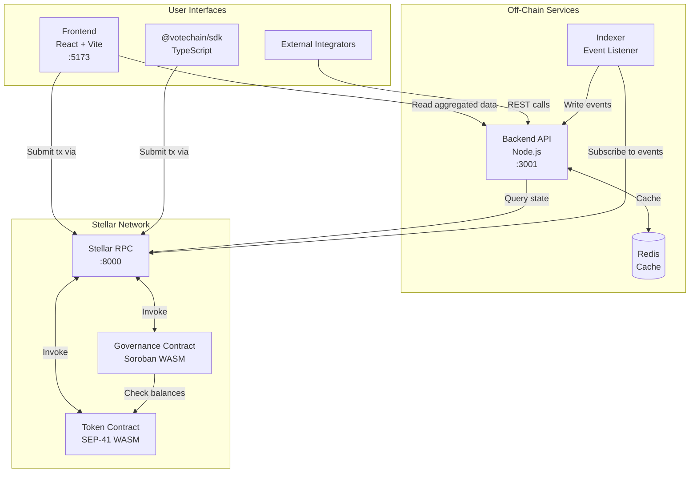
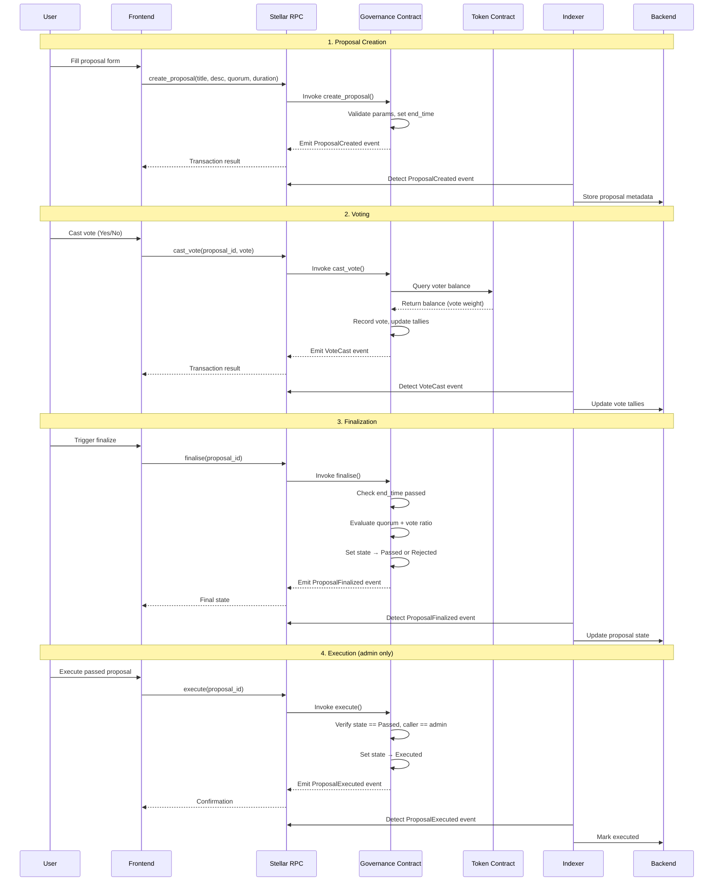

# Governance Workflow Architecture

This document shows how VoteChain's components interact during the governance lifecycle: proposal creation, voting, finalization, and execution.

---

## System Overview

---

## Governance Flow: Proposal Creation → Execution

---

## Data Flow Summary

| Stage | User Action | Contract Call | Data Written | Event Emitted |
|-------|------------|---------------|-------------|---------------|
| Create | Submit proposal form | `create_proposal()` | Proposal record (on-chain) | `ProposalCreated` |
| Vote | Cast Yes/No vote | `cast_vote()` | Vote record + updated tallies | `VoteCast` |
| Finalize | Trigger finalization | `finalise()` | Updated proposal state | `ProposalFinalized` |
| Execute | Admin executes | `execute()` | State → Executed | `ProposalExecuted` |
| Cancel | Admin cancels | `cancel()` | State → Cancelled | `ProposalCancelled` |

---

## Component Responsibilities

| Component | Role in Governance |
|-----------|--------------------|
| **Frontend** | User-facing proposal browser and voting interface. Submits transactions directly to Stellar RPC. |
| **Backend API** | Serves aggregated data (proposal lists, vote histories) from the indexer store. Does not submit on-chain transactions. |
| **Indexer** | Subscribes to on-chain events and writes them to the backend store for fast querying. |
| **Governance Contract** | Core logic: proposal CRUD, vote recording, quorum evaluation, state transitions. |
| **Token Contract** | Provides token balances used as vote weights. Manages mint/burn/transfer/allowances. |
| **SDK** | TypeScript wrappers for contract calls. Used by the frontend and external integrators. |
| **Stellar RPC** | Network gateway for submitting transactions and querying on-chain state. |
